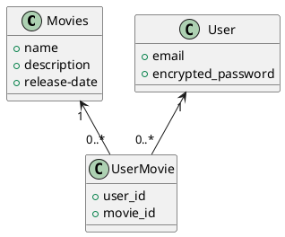

# Movies backend models documentation

```plantuml
@startuml
class Movies {
    + name
    + description
    + release-date
}
class User {
    + email
    + encrypted_password
}

class UserMovie {
    + user_id
    + movie_id
}

Movies "1" <-- "0..*" UserMovie
User "1" <-- "0..*" UserMovie
@enduml
```
